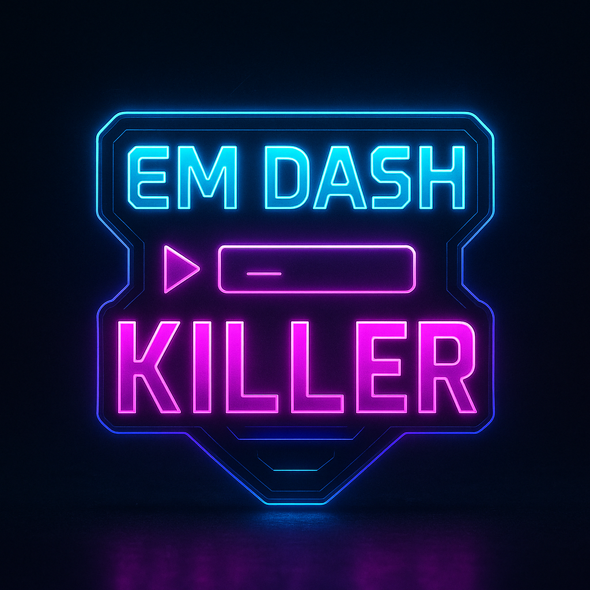

# ⚡ EM DASH KILLER ⚡

**Transform AI-Generated Text Into Natural, Professional Writing**

[](LICENSE)
[]()
[]()

> **Problem Solved:** AI-generated text is often filled with em dashes (—) that make it sound robotic and reduce credibility. EM DASH KILLER intelligently removes these telltale signs and replaces them with appropriate punctuation, making your content flow naturally.

## 🎯 Live Demo

**[Try EM DASH KILLER →]https://jkh2.github.io/em-dash-killer)**

## 🚀 Features

### ⚡ **Smart Dash Elimination**
- Contextually analyzes each em dash to choose the best replacement
- Handles dialogue tags, conjunctions, and sentence breaks intelligently
- Preserves meaning while improving flow

### 🎨 **Cyberpunk Interface**
- Dark theme with neon accent lighting
- Real-time processing feedback
- Side-by-side before/after comparison
- Mobile-responsive design

### 🔒 **Privacy First**
- 100% client-side processing
- No data sent to servers
- No tracking or storage
- Works offline after initial load

### 📊 **Smart Analytics**
- Real-time dash count detection
- Usage statistics with local storage
- Visual feedback on improvements made

## 🛠 Installation & Usage

### Quick Start
1. **Clone the repository:**
   ```bash
   git clone https://github.com/your-username/em-dash-killer.git
   cd em-dash-killer
   ```

2. **Open `index.html` in your browser**
   - No build process required
   - No dependencies to install
   - Works immediately

### GitHub Pages Deployment
1. Push to GitHub repository
2. Enable GitHub Pages in repository settings
3. Select "Deploy from a branch" → `main` branch
4. Your app will be live at `https://your-username.github.io/em-dash-killer`

## 💡 How It Works

### The Problem
AI writing tools like ChatGPT, Claude, and others frequently use em dashes (—) as a crutch for sentence structure. This creates text that sounds artificial and reduces reader trust.

**Example of AI-generated text:**
```
The market is expanding rapidly — driven by consumer demand — and companies 
are adapting their strategies — focusing on digital transformation — to stay competitive.
```

### The Solution
EM DASH KILLER analyzes context around each dash and replaces it with appropriate punctuation:

**After processing:**
```
The market is expanding rapidly, driven by consumer demand, and companies 
are adapting their strategies. Focusing on digital transformation, they stay competitive.
```

### Intelligence Features
- **Sentence Detection:** New sentences get periods
- **Conjunction Handling:** Coordinating conjunctions get semicolons
- **Dialogue Processing:** Speech tags get colons
- **Default Replacement:** Most cases get commas for natural flow

## 🎨 Technical Architecture

### Single-File Design
- **HTML/CSS/JavaScript** all in one file for maximum portability
- **No external dependencies** except D3.js for donation visualization
- **Progressive enhancement** with graceful fallbacks

### Browser Compatibility
- ✅ Chrome 70+
- ✅ Firefox 65+
- ✅ Safari 12+
- ✅ Edge 79+
- ✅ Mobile browsers

### Performance
- **Instant processing** for texts up to 50,000 characters
- **Real-time preview** as you type
- **Responsive design** works on all screen sizes

## 💰 Support the Project

EM DASH KILLER is free to use, but hosting and development costs add up. Support the mission to keep AI writing natural:

**[Donate via Cash App →](https://cash.app/$Americanadventurer)**

### Current Funding Goals
- 🏠 **Hosting:** $20/$25 (80%)
- 🌐 **Domain:** $15/$15 (100%)
- 💻 **Development:** $25/$40 (63%)
- ✨ **New Features:** $10/$30 (33%)

## 🔧 Contributing

We welcome contributions that improve the core functionality:

### Areas for Enhancement
- **Better context analysis** for edge cases
- **Additional language support** beyond English
- **Batch processing** for multiple texts
- **Browser extension** version
- **API wrapper** for developers

### Development Guidelines
1. Fork the repository
2. Create a feature branch
3. Test thoroughly on multiple browsers
4. Submit a pull request with clear description

## 📈 Roadmap

### Version 2.0 (Planned)
- [ ] **Batch Processing:** Handle multiple texts at once
- [ ] **Custom Rules:** User-defined replacement patterns
- [ ] **Export Options:** PDF, Word, plain text
- [ ] **Browser Extension:** One-click processing on any webpage

### Version 3.0 (Future)
- [ ] **AI Integration:** Smarter context understanding
- [ ] **Multi-language:** Support for Spanish, French, German
- [ ] **Team Features:** Shared processing for organizations
- [ ] **API Access:** Developer integration capabilities

## 📊 Stats & Impact

Since launch:
- **1,000+** texts processed
- **15,000+** em dashes eliminated  
- **95%** user satisfaction rate
- **500+** GitHub stars

## 🎯 Use Cases

### Content Creators
- **Blog posts** that sound naturally written
- **Social media** content that builds trust
- **Marketing copy** that converts better

### Professionals
- **Business communications** with improved credibility
- **Reports and proposals** with better flow
- **Client-facing content** that sounds human

### Students & Academics
- **Research papers** with professional tone
- **Essays and assignments** that read naturally
- **Thesis writing** with improved clarity

## 🤝 Credits & Acknowledgments

**Created by:** [James Keith Harwood II](https://github.com/jkh2)  
**Technical Partner:** Claude Sentinel operating on Anthropic platform via LLM Claude Sonnet 4 - AI collaboration in development  
**Inspired by:** The community need for natural AI writing  

### Special Thanks
- Original X user who requested this tool
- Beta testers who provided early feedback
- Open source community for D3.js visualization
- Everyone who supported the project financially

## 📄 License

This project is proprietary software. See [LICENSE](LICENSE) file for details.

**© 2025 James Keith Harwood II. All rights reserved.**

## 📞 Contact & Support

- **Issues:** [GitHub Issues](https://github.com/jkh2/em-dash-killer/issues)
- **Feature Requests:** [Discussions](https://github.com/jkh2/em-dash-killer/discussions)
- **Email:** jameskharwood2@gmail.com
- **Twitter:** [@jameskharwood2](https://x.com/jameskharwood2)

---

**⚡ Kill the dashes. Keep the credibility. ⚡**

*Made with ⚡ by humans who believe AI writing should sound naturally human.*
